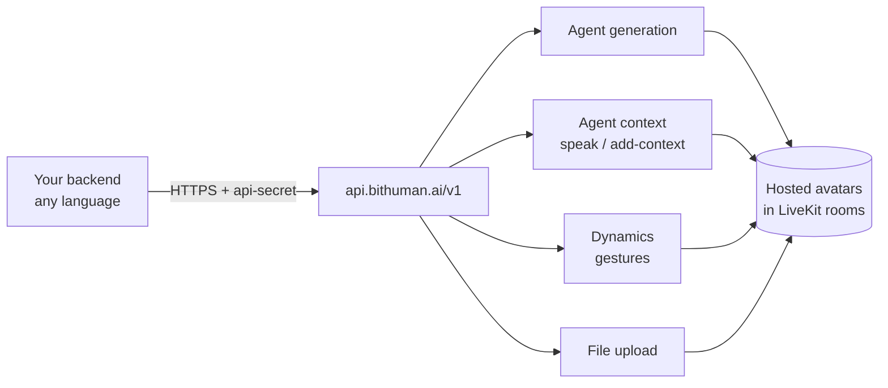

The bitHuman API lets you create, manage, and interact with avatar agents from any programming language. Use it when you don't need a native SDK — backends, CI scripts, or platforms where Python / Swift / Kotlin aren't a fit.



<CardGroup cols={3}>
  <Card title="Status" icon="signal">
    Live API status at [status.bithuman.ai](https://status.bithuman.ai).
  </Card>
  <Card title="Versioning" icon="code-branch">
    `v1` endpoints are general availability. Breaking changes ship under new path prefixes.
  </Card>
  <Card title="Changelog" icon="clock-rotate-left" href="/changelog">
    Product-level release notes and API changes.
  </Card>
</CardGroup>

## Where to send requests

```
https://api.bithuman.ai
```

## Your first call

The cheapest call you can make. Verifies your API secret without spending credits or needing an existing agent:

```bash
curl -X POST https://api.bithuman.ai/v1/validate \
  -H "api-secret: $BITHUMAN_API_SECRET"
```

A `200` response means your secret is valid. Any other status is an authentication or networking problem — see the [Error Reference](/api-reference/errors).

## How to authenticate every call

Every request needs the `api-secret` header. Get yours at [Developer → API Keys](https://www.bithuman.ai/#developer).

```http
api-secret: YOUR_API_SECRET
```

Treat the secret like a password — never check it into source control, never embed it in client apps. For browser-side embeds, use the [embed token flow](/guides/deployment) instead.

## How agents are identified

Every endpoint identifies an agent by its **agent code** — a short string like `A91XMB7113`.

You receive an agent code when you [generate an agent](/api-reference/agent-generation), or find one in your [Library](https://www.bithuman.ai/#library) (click an agent to reveal it).

<Note>
Different endpoint paths use slightly different parameter names for the same value: `{code}`, `{agent_code}`, or sometimes `{agent_id}`. They all expect the same string — the agent code shown in your Library.
</Note>

## What you can call

<CardGroup cols={2}>
  <Card title="Agent Generation" icon="wand-magic-sparkles" href="/api-reference/agent-generation">
    Create new avatar agents from prompts, images, or video
  </Card>
  <Card title="Agent Management" icon="users-gear" href="/api-reference/agent-management">
    Validate credentials, retrieve agent details, update prompts
  </Card>
  <Card title="Agent Context" icon="message" href="/api-reference/agent-context">
    Send real-time messages and inject context into live sessions
  </Card>
  <Card title="File Upload" icon="upload" href="/api-reference/file-upload">
    Upload images, audio, video, and documents
  </Card>
  <Card title="Dynamics" icon="person-running" href="/api-reference/dynamics">
    Generate and manage avatar movements and gestures
  </Card>
  <Card title="Runtime Tokens" icon="key" href="/api-reference/runtime-tokens">
    Mint short-lived JWTs for streaming avatar sessions
  </Card>
  <Card title="Credit Summary" icon="wallet" href="/api-reference/credit-summaries">
    Read user balance + per-mode minute estimates
  </Card>
  <Card title="Rate Limits & Billing" icon="credit-card" href="/api-reference/rate-limits">
    Concurrent-session caps, tier limits, plan pricing
  </Card>
</CardGroup>

<Note>
**Internal endpoints not documented here:** `/v1/realtime-user` and
`/v1/realtime-agent` (OpenAI Realtime API proxies), the `/launch`
worker endpoint (used by the avatar-dispatcher), the
`/v1/embed-tokens/request` token-mint (called by the iframe embed
flow under [Deployment](/guides/deployment)), and the
Organizations / User-scoped API-Secrets surfaces. These are stable
but used primarily by our first-party UIs and aren't part of the
public integration surface. Open a GitHub issue or ping
[Discord](https://discord.gg/ES953n7bPA) if you need them.
</Note>

## Generate a client from the OpenAPI spec

The complete API contract is published as OpenAPI 3.1 at [`api-reference/openapi.yaml`](https://github.com/bithuman-product/bithuman-sdk-public/blob/main/docs/api-reference/openapi.yaml). Use it to generate clients in any language.

## What errors look like

All errors follow the same structure:

```json
{
  "error": {
    "code": "ERROR_CODE",
    "message": "Human-readable error description",
    "httpStatus": 401
  },
  "status": "error",
  "status_code": 401
}
```

| HTTP Status | Meaning |
|---|---|
| `200` | Success |
| `400` | Malformed JSON or unexpected payload shape |
| `401` | Invalid or missing `api-secret` |
| `402` | Insufficient credits |
| `404` | Resource not found |
| `413` | Payload too large |
| `415` | Unsupported media type |
| `422` | Validation error |
| `429` | Rate limit exceeded |
| `500` | Internal server error |
| `503` | Service unavailable (workers busy) |

See the [Error Reference](/api-reference/errors) for the full code catalog.
