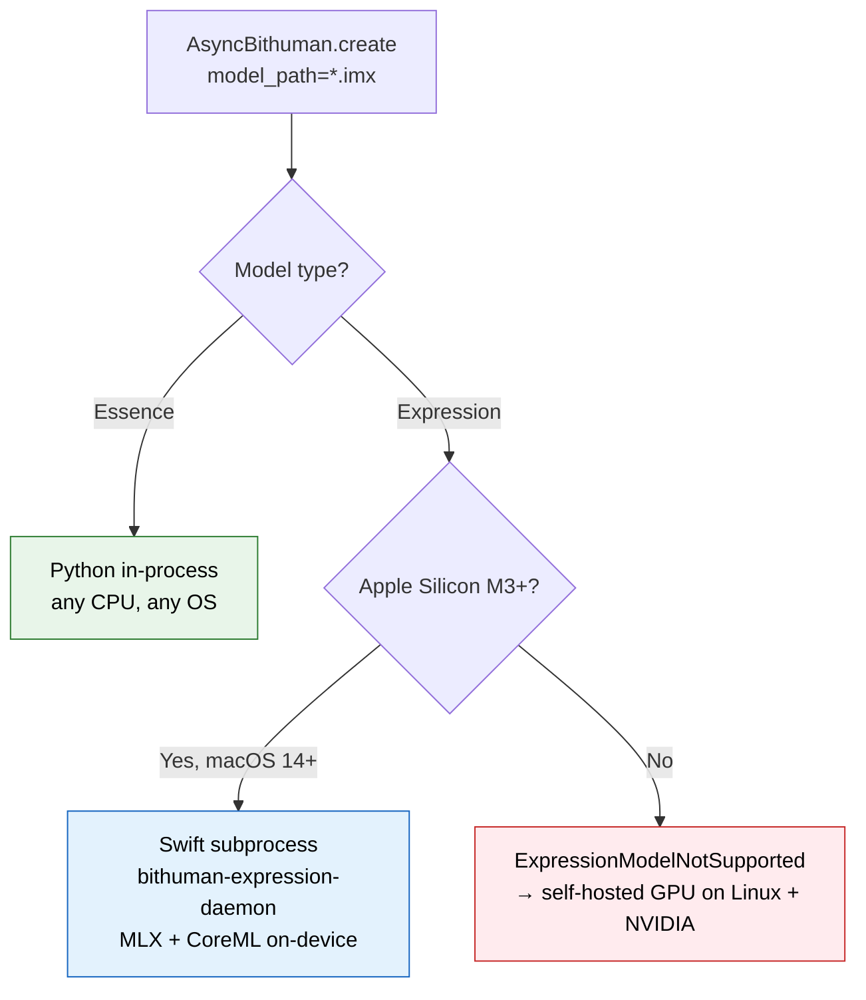

## What you get

Three inputs, one output. The \`.imx\` bundle is the single weights file; the portrait is the identity you pass at runtime.

```
expression.imx  +  portrait.jpg  +  speech.wav   ──►   demo.mp4  (25 FPS, lip-synced)
```

<Info>
  **Requirements.** macOS 14+, Apple Silicon **M3 or later** (M5+ recommended for the smoothest experience), 16 GB RAM, ~5 GB free disk, Python 3.9–3.14. M1 / M2 / Intel fall back to [self-hosted GPU](/deployment/self-hosted-gpu).
</Info>

## Quick start (3 steps)

<Steps>
  <Step title="Install the SDK">
    ```bash
    python -m venv .venv
    .venv/bin/pip install --upgrade bithuman opencv-python-headless
    ```

    The `bithuman` wheel for macOS arm64 ships `bithuman-expression-daemon` pre-built — no extra setup.
  </Step>

  <Step title="Get an API secret">
    From [bithuman.ai](https://www.bithuman.ai) → **Developer** → **API Keys**. Expression costs 2 credits / minute of rendered video.

    ```bash
    export BITHUMAN_API_SECRET=sk_live_...
    ```
  </Step>

  <Step title="Run it">
    Zero-argument path — the CLI auto-downloads the ~3.7 GB demo `.imx` bundle on first run (cached to `~/.cache/bithuman/models/`) and renders a 15 s sample clip:

    ```bash
    .venv/bin/bithuman demo
    ```

    Or pass your own portrait + audio:

    ```bash
    .venv/bin/bithuman demo --identity portrait.jpg --audio speech.wav
    ```

    <Check>
      Expect **`✓ Wrote demo.mp4 — N frames @ 25 FPS`**. Model load: ~10 s. First frame: &lt; 1.3 s. Rendering: ~0.5× real time on M3, ~1× on M5.
    </Check>

    <Tip>
      **One `.imx` bundle, any face.** The bundle carries the full pipeline (animator, speech encoder, face encoder, renderer). The face you animate is just a JPG/PNG you pass as `--identity`. For custom-trained bundles, download from your [bitHuman dashboard](https://www.bithuman.ai) or pack one via `bithuman pack` (advanced).
    </Tip>
  </Step>
</Steps>

## Use a gallery portrait (instead of your own)

Every persona from the [Halo app](/examples/halo-macos) is a public portrait URL. Pass it directly to `--identity` — no download step, the CLI caches it under `~/.cache/bithuman/identities/` after first use.

```bash
.venv/bin/bithuman demo \
    --model expression.imx \
    --identity "https://tmoobjxlwcwvxvjeppzq.supabase.co/storage/v1/object/public/bithuman/A91MJY5711/image_20260312_205650_781649.jpg" \
    --audio speech.wav \
    --output einstein.mp4
```

### Agent gallery { #agent-gallery }

| Code | Name | Character |
|---|---|---|
| `A74NWD9723` | Energetic Audio Story Buddy | Podcast-host storyteller (Halo's default) |
| `A91MJY5711` | Warm Relativity Mentor Einstein | Einstein reimagined as a curious mentor |
| `A22MCJ3461` | Late-Night Interview Host | Charming talk-show riff |
| `A32XFH3193` | Ethics Advisor | Boardroom-grade principled advisor |
| `A43XYD7624` | Stage Presence Coach | Stand-up comic + coach |
| `A24HAC6344` | Fairy-Tale Grandmother | Storytime narrator |
| `A02GXF3393` | Whimsical Bee Entertainer | Giggly bee mascot |
| `A37QAW0225` | Pirate Trivia Host | Captain Quizbeard |
| `A23WJF0199` | Wise Pup | Sir Barksworth the British dog |

URL pattern:

```
https://tmoobjxlwcwvxvjeppzq.supabase.co/storage/v1/object/public/bithuman/<CODE>/image_*.jpg
```

## In Python

Same pipeline, from the SDK:

```python
import asyncio, os
from bithuman import AsyncBithuman

async def main():
    runtime = await AsyncBithuman.create(
        model_path="expression.imx",
        api_secret=os.environ["BITHUMAN_API_SECRET"],
        identity="portrait.jpg",   # optional; omit to use the bundle's default face
    )
    # pcm_float32 is your 16 kHz mono PCM buffer. Producing the
    # buffer and displaying the frame is app-specific (record via
    # sounddevice, render via cv2.imshow) — omitted here.
    await runtime.push_audio(pcm_float32, 16_000)
    await runtime.flush()
    async for frame in runtime.run():
        if frame.has_image:
            display(frame.bgr_image)
        if frame.end_of_speech:
            break
    await runtime.shutdown()

asyncio.run(main())
```

### Change the face mid-session

```python
await runtime.interrupt()                    # drop any in-flight audio
await runtime.set_identity("bob.jpg")        # ~300 ms for a jpg, instant for a .npy
# push more audio — the new face animates immediately
```

| `identity=` value | Cost at load / swap |
|---|---|
| `None` (default) | 0 — uses bundle's baked-in face |
| `"portrait.jpg"` / `.png` | ~300 ms (encoder pass) |
| `"portrait.npy"` (cached) | instant |

Cache a portrait by saving the encoded `.npy` to disk and reusing it across sessions.

## How it works

One `pip install bithuman` dispatches to the right runtime automatically:



Inside the Swift subprocess: MLX on the GPU (speech encoder + diffusion animator), CoreML on the Neural Engine (face renderer). Python only shuffles PCM + frames over a framed stdio pipe.

<Accordion title="Performance contract">
  - **Per-frame budget ≤ 40 ms** (25 FPS enforced by the actor)
  - **First-frame latency ≤ 1.3 s** (full receptive field) / ≤ 450 ms (partial window)
  - **Bounded memory** — working set caps at ~4 GB during a burst; `shutdown()` releases
  - **One model evaluation at a time** — Halo uses `setLLMGenerating(true/false)` to keep the avatar from contending with the LLM for the GPU during generation
</Accordion>

## Troubleshooting

| Symptom | Cause + fix |
|---|---|
| `ExpressionModelNotSupported` on an M1 / M2 Mac | Animator requires M3 or later memory bandwidth. Use an M3+ Mac, or the [self-hosted GPU deployment](/deployment/self-hosted-gpu) on Linux + NVIDIA. |
| `ExpressionModelNotSupported` on Intel / Linux / Windows | No local path — use the [self-hosted GPU deployment](/deployment/self-hosted-gpu). |
| `pre-encoded identity spatial dim N ≠ pipeline dim M` | The cached `.npy` was encoded for a different renderer resolution than the one in your `.imx`. Re-encode from the source portrait. |
| First-frame latency > 1.3 s | Usually another MLX workload (LLM, another avatar) is contending for the GPU. Serialize with `setLLMGenerating(true/false)` while the LLM is generating. |
| Stuttering lip-sync during long replies on M3 / M4 | Requires `bithuman` ≥ 1.10.6 + `BithumanAvatar` 0.6.2 (or newer) — they ship the concurrent-MLX fix. |

## Advanced

<Accordion title="Build your own Expression bundle from raw weights">
  The `bithuman pack` CLI packs raw animator + encoder + renderer weights into an `.imx`. This is for **model authors**, not consumers — if you're here to integrate Expression into an app, you don't need it.

  ```bash
  bithuman pack --help
  ```
</Accordion>

<Accordion title="Clone the full example repo">
  ```bash
  git clone https://github.com/bithuman-product/bithuman-examples.git
  cd bithuman-examples/apple-expression
  .venv/bin/python quickstart.py --model expression.imx --audio speech.wav
  ```

  Same API as the CLI, more hooks to customize.
</Accordion>

## Next steps

<CardGroup cols={2}>
  <Card title="PyPI: bithuman" icon="python" href="https://pypi.org/project/bithuman/">
    `pip install bithuman` — SDK reference, changelog, release history.
  </Card>
  <Card title="bitHuman Halo (consumer app)" icon="sparkles" href="/examples/halo-macos">
    The free desktop companion built on this exact pipeline.
  </Card>
  <Card title="Self-hosted GPU (Linux + NVIDIA)" icon="gpu-card" href="/deployment/self-hosted-gpu">
    Same Expression animator, CUDA backend — for hosts without Apple Silicon.
  </Card>
  <Card title="AI voice agent (LiveKit)" icon="comments" href="/examples/ai-conversation">
    Wire this pipeline into LiveKit + an LLM + TTS for a full voice agent.
  </Card>
</CardGroup>
