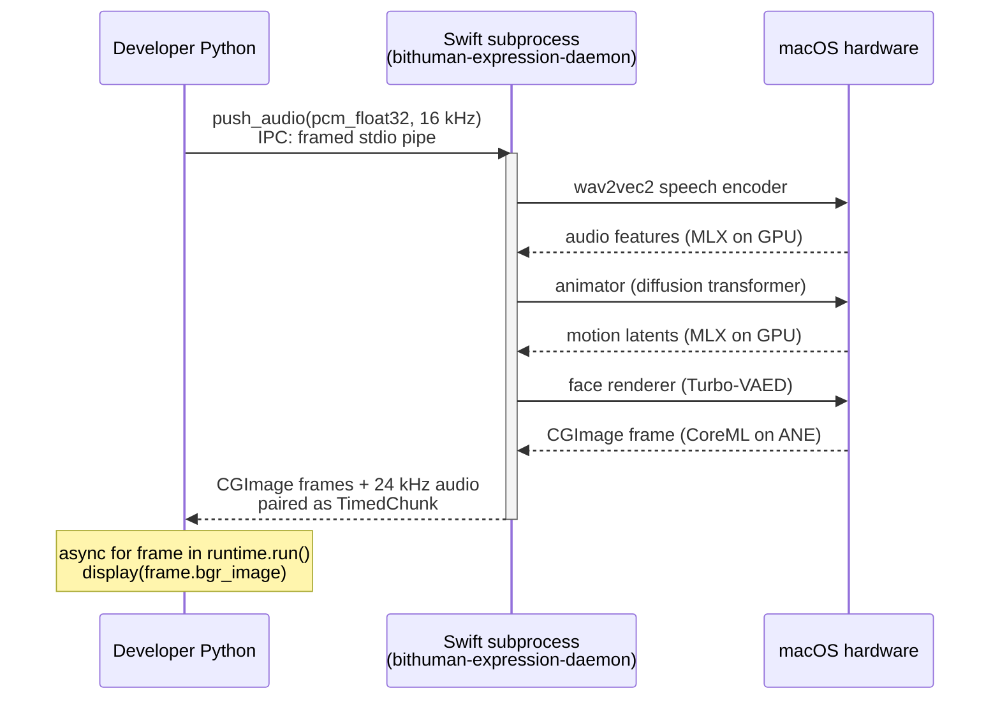

Run a custom-face **Expression** avatar entirely on your Mac — no GPU, no cloud, no Docker. The Python SDK transparently dispatches to a bundled Swift subprocess that drives the animator, face encoder, and face renderer on Apple's Neural Engine + GPU.

<Info>
  **Requires an M5 or later Mac.** The animator needs M5-class GPU memory bandwidth to sustain 25 FPS. M1/M2 raises `ExpressionModelNotSupported` with install guidance.
</Info>

## Which runtime do you get?

One `pip install bithuman` — three possible runtimes, selected automatically by model type and host hardware:


This page covers the middle path — Expression on an M5+ Mac.

## What you build

A Python script that takes one `.imx` avatar bundle plus any WAV file and writes a 25 FPS lip-synced MP4. Full source is in the **[`apple-expression/`](https://github.com/bithuman-product/bithuman-examples/tree/main/apple-expression)** example on GitHub.

```
expression.imx + speech.wav ──► quickstart.py ──► out.mp4  (25 FPS, lip-synced)
```

## Requirements

| | |
|---|---|
| macOS | 14 or later |
| Chip | Apple Silicon, **M5 or later** (M1/M2 unsupported) |
| RAM | 16 GB |
| Disk | ~5 GB free (model weights) |
| Python | 3.9 – 3.14 |
| Tools | `ffmpeg` (`brew install ffmpeg`) |

## Quick Start

<Steps>
  <Step title="Install">
    ```bash
    python -m venv .venv
    .venv/bin/pip install --upgrade bithuman opencv-python-headless
    ```

    On macOS arm64 the `bithuman` wheel ships `bithuman-expression-daemon` pre-built — the Swift subprocess the runtime spawns when you load an Expression `.imx`.
  </Step>

  <Step title="Get an API secret">
    From [bithuman.ai](https://bithuman.ai) → Developer → API Keys. Expression is 2 credits / minute of rendered video.

    ```bash
    export BITHUMAN_API_SECRET=your_secret_from_bithuman.ai
    ```
  </Step>

  <Step title="Get the Expression bundle">
    Download `expression.imx` from your [bitHuman dashboard](https://www.bithuman.ai). **One bundle, any face** — the `.imx` carries the animator, speech encoder, face encoder, and renderer; the face you want to animate is just a portrait image you pass at runtime via `identity=`.

    <Tip>
      `bithuman pack` (CLI) is a separate, advanced workflow for **building an Expression bundle from raw weights**. If you're an application developer consuming Expression — not training it — you don't need it. Just grab the bundle and pass portraits.
    </Tip>
  </Step>

  <Step title="Run the CLI demo">
    ```bash
    .venv/bin/bithuman demo --model expression.imx --audio speech.wav
    ```

    `--audio` defaults to a bundled sample if omitted. Model load: ~10 s. First frame: &lt; 1.3 s. Rendering: ~0.5× real time.

    <Check>Expect **`✓ Wrote demo.mp4 — 393 frames @ 25 FPS`** and a lip-synced video of the bundle's baked-in face talking for 15 s.</Check>
  </Step>

  <Step title="Pick a face">
    Pass any portrait as `--identity` — local file or URL. The SDK encodes it on load (~300 ms on M5+):

    ```bash
    .venv/bin/bithuman demo --model expression.imx --identity alice.jpg
    ```

    Or pull from the [agent gallery](#agent-gallery) below:

    ```bash
    .venv/bin/bithuman demo \
        --model expression.imx \
        --identity "https://tmoobjxlwcwvxvjeppzq.supabase.co/storage/v1/object/public/bithuman/A74NWD9723/image_20251122_000244_372799.jpg"
    ```

    Portraits are cached under `~/.cache/bithuman/identities/` after the first download. Omit `--identity` entirely to use the bundle's default face.
  </Step>

  <Step title="Go deeper — clone the full example">
    When you're ready to hack on the pipeline, grab the full example — same API, more hooks to customize:

    ```bash
    git clone https://github.com/bithuman-product/bithuman-examples.git
    cd bithuman-examples/apple-expression
    .venv/bin/python quickstart.py --model expression.imx --audio speech.wav
    ```
  </Step>
</Steps>

## Agent gallery

Every pre-curated bitHuman persona from the [Halo app](/examples/halo-macos) is available as a ready-made `--identity`. Portraits are public URLs — no auth needed; the CLI caches them on first use. Popular picks:

| Code | Name | Character |
|---|---|---|
| `A74NWD9723` | Energetic Audio Story Buddy | Podcast-host storyteller (Halo's default) |
| `A91MJY5711` | Warm Relativity Mentor Einstein | Einstein reimagined as a curious mentor |
| `A22MCJ3461` | Late-Night Interview Host | Charming talk-show riff |
| `A32XFH3193` | Ethics Advisor | Boardroom-grade principled advisor |
| `A43XYD7624` | Stage Presence Coach | Stand-up comic + coach |
| `A24HAC6344` | Fairy-Tale Grandmother | Storytime narrator |
| `A02GXF3393` | Whimsical Bee Entertainer | Giggly bee mascot |
| `A37QAW0225` | Pirate Trivia Host | Captain Quizbeard |
| `A23WJF0199` | Wise Pup | Sir Barksworth the British dog |

Each portrait lives at:

```
https://tmoobjxlwcwvxvjeppzq.supabase.co/storage/v1/object/public/bithuman/<CODE>/image_*.jpg
```

Pass any of them directly:

```bash
.venv/bin/bithuman demo \
    --identity "https://tmoobjxlwcwvxvjeppzq.supabase.co/storage/v1/object/public/bithuman/A91MJY5711/image_20260312_205650_781649.jpg" \
    --output einstein.mp4
```

## Python or Swift?

Two parallel example projects — pick the one that matches your app:

<CardGroup cols={2}>
  <Card title="Python (recommended)" icon="python" href="https://github.com/bithuman-product/bithuman-examples/tree/main/apple-expression">
    `pip install bithuman` + `bithuman demo`. Auto-dispatches to the Swift daemon on macOS M5+, or to the in-process Essence runtime everywhere else. What this page walks through.
  </Card>
  <Card title="Swift" icon="swift">
    Native `BithumanAvatar` SwiftPM library + AVAssetWriter. Ships with the private Swift SDK repo ([contact us](https://bithuman.ai) for access). Same `.imx` format, same API shape, no ffmpeg dependency.
  </Card>
</CardGroup>

## How it works



Everything inside the Swift subprocess is `bithuman-expression-daemon` — MLX on the GPU, CoreML on the Neural Engine. Python only shuffles frames + audio over a framed stdio pipe, so there's nothing to configure: `pip install bithuman` gives you the whole chain.

The actor serializes one model evaluation at a time, enforces the 40 ms per-frame budget, and the audio-clocked contract means frames emit *as audio is consumed* — you own the display timer.

## Minimal SDK snippet

```python
import asyncio, os
from bithuman import AsyncBithuman

async def main():
    runtime = await AsyncBithuman.create(
        model_path="expression.imx",
        api_secret=os.environ["BITHUMAN_API_SECRET"],
        identity="alice.jpg",   # optional; omit to use the bundle's default face
    )
    # pcm_float32 is your 16 kHz mono PCM buffer. Producing the
    # buffer and displaying the frame is app-specific (e.g. record
    # via sounddevice, render via cv2.imshow) — omitted here.
    await runtime.push_audio(pcm_float32, 16_000)
    await runtime.flush()
    async for frame in runtime.run():
        if frame.has_image:
            display(frame.bgr_image)  # app-specific
        if frame.end_of_speech:
            break
    await runtime.shutdown()

asyncio.run(main())
```

## Changing the face mid-session

Halo's "drag-drop a new portrait" flow uses `set_identity()` — no model reload:

```python
await runtime.interrupt()                    # drop any in-flight audio
await runtime.set_identity("bob.jpg")        # ~300 ms for a jpg, instant for a .npy
# push more audio — the new face animates immediately
```

| `identity=` value | Cost at load / swap |
|---|---|
| `None` (default) | 0 — uses bundle's baked-in face |
| `"alice.jpg"` / `.png` | ~300 ms (encoder pass) |
| `"alice.npy"` (cached) | ~instant |

Cache a portrait once by saving the encoded `.npy` to disk and reusing it across sessions.

## Troubleshooting

| Symptom | Cause + fix |
|---|---|
| `ExpressionModelNotSupported` on an M1/M2 Mac | Animator requires M5+ memory bandwidth. Use an M5 or later, or the [self-hosted GPU deployment](/deployment/self-hosted-gpu) on Linux + NVIDIA. |
| `ExpressionModelNotSupported` on Intel / Linux / Windows | No local path — use the [self-hosted GPU deployment](/deployment/self-hosted-gpu). |
| Error mentioning `pre-encoded identity spatial dim N ≠ pipeline dim M` | The cached `.npy` was encoded for a different renderer resolution than the one in your `.imx`. Re-encode from the source portrait. |
| First-frame latency > 1.3 s | One-time warm-up is ≤ 1.3 s (full receptive field) or ≤ 450 ms (partial window). Anything longer usually means another MLX workload is contending for the GPU. |
| Daemon logs aren't in stdout | The runtime redirects daemon logs to stderr to keep the IPC pipe clean. Capture the child's stderr via `runtime._process.stderr` (exposed as stable API in a future minor release). |

## Performance contract

- **Per-frame budget ≤ 40 ms** (25 FPS enforced by the actor)
- **Bounded memory** — working set caps at ~4 GB during a burst; `shutdown()` releases
- **First-frame latency ≤ 1.3 s**
- **One model evaluation at a time** — Halo's `setLLMGenerating(true/false)` hook exists to gate idle animation against concurrent LLM generation

## Next steps

<CardGroup cols={2}>
  <Card title="PyPI package" icon="python" href="https://pypi.org/project/bithuman/">
    `pip install bithuman` — the full Python SDK, changelog, and release history.
  </Card>
  <Card title="bitHuman Halo (consumer app)" icon="sparkles" href="/examples/halo-macos">
    The reference desktop app built on this exact pipeline.
  </Card>
  <Card title="Self-hosted GPU (Linux + NVIDIA)" icon="gpu-card" href="/deployment/self-hosted-gpu">
    Same Expression animator, CUDA backend — for hosts without Apple Silicon.
  </Card>
  <Card title="AI conversation example" icon="comments" href="/examples/ai-conversation">
    Wire this pipeline into LiveKit + an LLM + TTS for a full voice agent.
  </Card>
</CardGroup>
