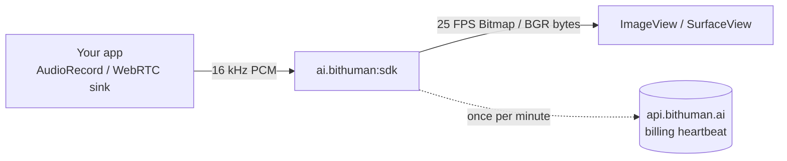

`ai.bithuman:sdk` is an Android AAR that drops the bitHuman avatar runtime into a Kotlin or Java app. Audio in (16 kHz mono PCM), 25 FPS video frames out. All inference runs on-device; the avatar pipeline is metered via a one-request-per-minute billing heartbeat.



<CardGroup cols={2}>
  <Card title="Kotlin quickstart" icon="rocket" href="/kotlin-sdk/quickstart">
    Maven coord and a 10-line example
  </Card>
  <Card title="Streaming API" icon="bolt" href="/kotlin-sdk/streaming">
    Push audio, pull frames — for long-running conversations
  </Card>
  <Card title="Architecture" icon="diagram-project" href="/getting-started/architecture">
    How the AAR fits with the other SDKs
  </Card>
  <Card title="Examples" icon="book-open" href="/examples/kotlin-android-hello">
    Hello-world Android project
  </Card>
</CardGroup>

## Install and run

<CodeGroup>

```kotlin build.gradle.kts
android {
    defaultConfig {
        ndk { abiFilters += setOf("arm64-v8a") }
        minSdk = 29
    }
}

dependencies {
    implementation("ai.bithuman:sdk:1.17.1")
}
```

```kotlin Hello.kt
import ai.bithuman.sdk.Bithuman

val runtime = Bithuman.createRuntime("/path/to/avatar.imx")
println("frame size: ${runtime.frameWidth} x ${runtime.frameHeight}")

// Push 16 kHz mono PCM as it arrives, drain frames on a Choreographer tick.
runtime.pushAudio(pcmShortArray)
val frameOut = ByteArray(runtime.frameWidth * runtime.frameHeight * 3)
while (runtime.ticksAvailable > 0) {
    runtime.pullFrame(frameOut, frameIdxHint = -1)
    renderer.present(frameOut)
}
runtime.close()
```

</CodeGroup>

The AAR is self-contained — no extra system dependencies. `arm64-v8a` only.

## Compatibility

| Field | Value |
|---|---|
| **Maven coord** | `ai.bithuman:sdk:1.17.1` |
| **ABI** | `arm64-v8a` only |
| **Min SDK** | 29 (Android 10) |
| **Compile SDK** | 35 |
| **NDK** | 28.0.13004108 |
| **AAR size** | ~40 MB |

The AAR bundles all native libraries — your app doesn't need to add ONNX Runtime, OpenSSL, or any other system dependency separately.

## Public API

All public types live in `ai.bithuman.sdk`:

| Tier | Types | Use when… |
|---|---|---|
| **High-level** | `Avatar`, `ComposedFrame` | Single conversation, one model file in scope |
| **Low-level** | `Fixture`, `FixtureInfo`, `Runtime`, `ComposeResult` | Multi-conversation host — share one model file across many sessions |
| **Streaming** | `Runtime.pushAudio` / `frames()` / `resetStream` | Long live conversations — see [Streaming API](/kotlin-sdk/streaming) |
| **Config** | `ExecutionProvider` | Backend hint (`CPU` / `AUTO` / `NNAPI` / `QNN`) |
| **Errors** | `BithumanException` | Single exception type with typed error codes |
| **Auth** | `BithumanAuth`, `AuthState` | Direct heartbeat control (rarely needed) |

The `Avatar` facade is the simplest path — one avatar, one conversation. For hosts that run many concurrent sessions, share one `Fixture` across many `Runtime` instances to amortize the model load.

## Hardware

`arm64-v8a` only. Runs on modern Android silicon (Snapdragon 8 Gen 1+, Tensor G2+, similar). Older arm64 chips haven't been characterized — treat them as unsupported for production until measured.

## Authentication

```bash
export BITHUMAN_API_SECRET=...
```

Sign in at [www.bithuman.ai → Developer → API Keys](https://www.bithuman.ai/#developer) to fetch a secret. The library exchanges the secret for a short-lived runtime token at startup and auto-renews on the billing heartbeat (5-minute offline grace). Full flow: [Authentication](/getting-started/authentication).

## Roadmap

`armeabi-v7a` and `x86_64` are not currently supported. Open a request on the [GitHub issue tracker](https://github.com/bithuman-product/bithuman-sdk-public/issues) if you need them.

## See also

<CardGroup cols={2}>
  <Card title="Kotlin quickstart" icon="rocket" href="/kotlin-sdk/quickstart">
    Maven coord + 10-line example
  </Card>
  <Card title="Install" icon="download" href="/getting-started/install">
    All install channels on one page
  </Card>
  <Card title="Swift SDK" icon="apple" href="/swift-sdk/overview">
    Same runtime on Apple platforms
  </Card>
  <Card title="Flutter plugin" icon="layer-group" href="/integrations/flutter">
    Cross-platform Dart wrapper
  </Card>
</CardGroup>
